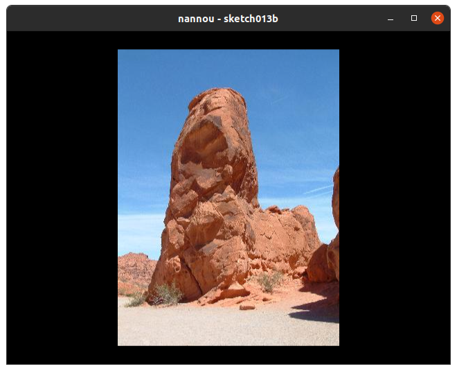

# book-aagtp v1

## Description

Based on the Book [An Artist's Guide to Programming](https://nostarch.com/artists-guide-programming)



## Dependencies

* [Nannou](https://github.com/nannou-org/nannou)


## Build and run

```
cargo build --release

cargo run --release
```
## Author

* [Antonio Soares](https://github.com/ccie18473)

## License

This project is licensed under the [MIT] License - see the LICENSE.md file for details
